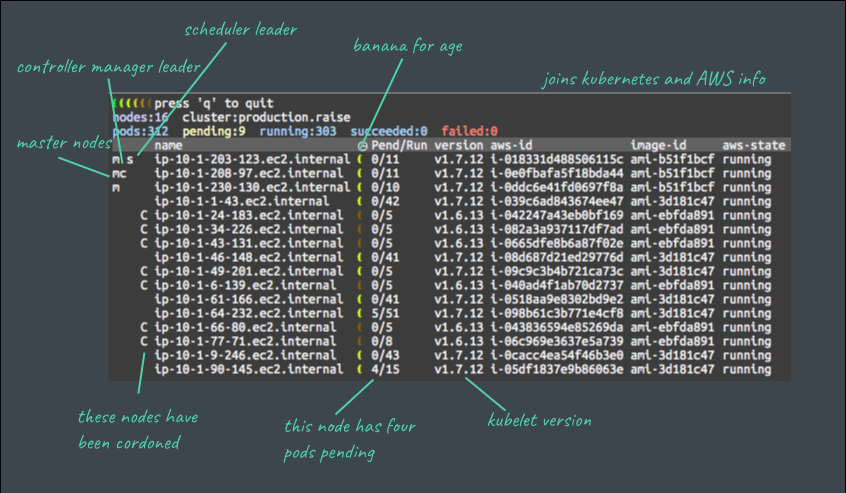

# kubesat

Terminal dashboard with various info from Kubernetes, AWS.

Primary use case is to assist with in-place cluster upgrades, whether
between patch versions, or, as shown in the screenshot from Kubernetes
1.6 to 1.7.



Uses your `~/.kube/config` to find a Kubernetes cluster.

Currently is read-only, though probably won't be forever, so use with care!

Usage (use `go install` for incremental compilation):

```
$ cd $GOPATH/src/github.com/raisemarketplace/kubesat
$ go install && kubesat
```

